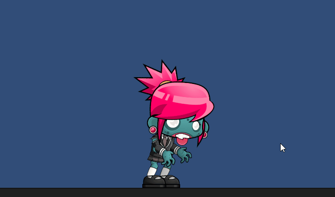
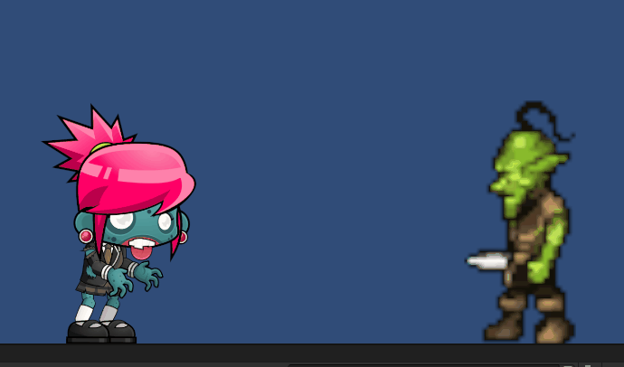
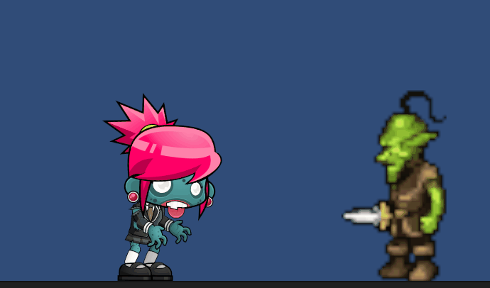
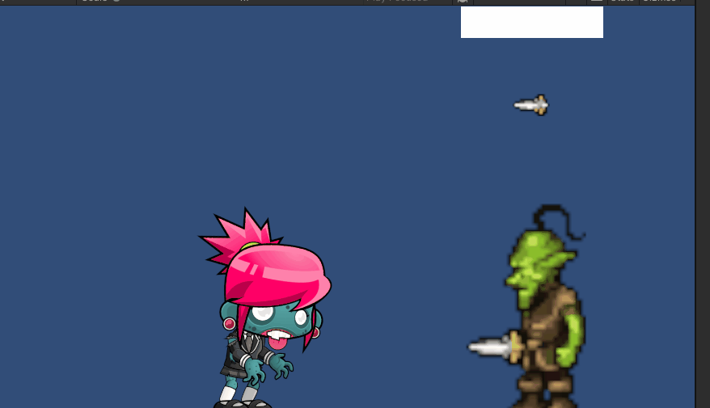
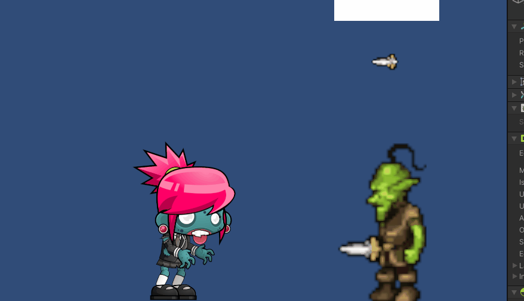

# FDV_Sprites
Práctica de Scripts en Unity

Para esta práctica los sprites utilizados se encuentran en Assets/Sprites/Zombie y Assets/Sprites/Goblin respectivamente.

Para mover al zombie se usa un transform.position y para saltar se usa el rigidbody.
   

   
Para el zombie se han creado tres animaciones a partir de los sprites y para el goblin dos. Ambos cuentan con sus respectivas máquinas de estados. Las animaciones del zombie son iddle, dead, y move. Para el Goblin son iddle y attack.
Para girar el sprite en el movimiento se emplea la función flip.
   

Para las colisiones se activan parametros en cada animación que activan sus respectivas animaciones.
   

Para hacer el joint, se hace un cubo desde el que cuelga una daga. El rigidbody del cubo es del cual cuelga la daga.
   

Se han añadido las fisicas según el guión para ambos personajes. En el primero de los siguientes gif el goblin no tiene activado el isTrigger y cuando la zombie muere desplaza al goblin. En el segundo lo tiene activado y por ello la gravedad lo hace caer.
   

   
   
